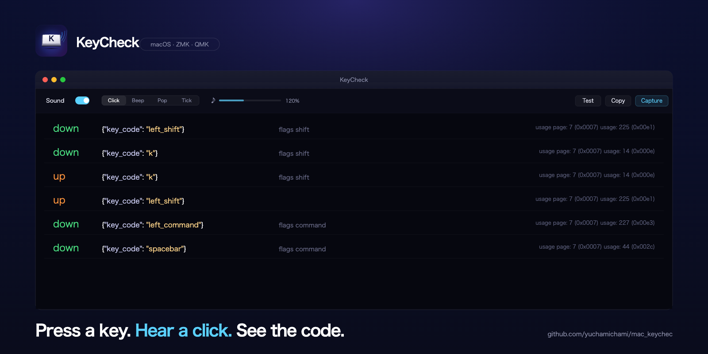

# KeyCheck

<p align="center">
  
</p>

自作キーボード(ZMK / QMK等)用のキーテスター。Karabiner-EventViewer風表示で、**全キーで音が鳴る** (modifier含む)、音量0–150%。

| | 即起動 | カスタム | 無変換/変換 |
|---|:---:|:---:|:---:|
| 🌐 [**ブラウザ版**](https://yuchamichami.github.io/key_check/) | ✅ | — | ✅ Chrome等で取れる |
| 🖥️ ネイティブ (.app) | — | ✅ ZMK向けカスタマイズ可 | ❌ NSEvent制約 |

## 機能

- **Karabinerスタイル表示**: `{"key_code":"left_shift"}` + USB HID usage page/code、左右別 modifier (`left_command` / `right_shift` 等)
- **全キー音響フィードバック** — 4音色 (Click / Beep / Pop / Tick)、ロータリーノブで0–150%音量 (100%超は EQ ゲインで増幅)
- **マウスボタン対応** — `{"pointing_button":"buttonN"}`
- **Copy / Clear** — イベントログをクリップボードへ

## クイックスタート

### ブラウザ版 (推奨)
何もインストールせずに即起動: **https://yuchamichami.github.io/key_check/**

### ネイティブ (.app) 版

```bash
git clone https://github.com/yuchamichami/key_check.git
cd key_check
./build.sh
open KeyCheck.app
```

`build.sh` が以下の優先度で自動署名:
1. **Apple Development / Developer ID** (キーチェーンにあれば自動使用 — 推奨)
2. **KeyCheck Local Signer** (`./setup_signing.sh` で自己署名作成)
3. **Ad-hoc** (フォールバック)

> Apple Development 証明書は Xcode → Settings → Accounts に Apple ID を追加して `+` から無料で作成できます。安定したcdhashになるので、リビルドしても権限がリセットされません(NSEventベースの現行版は権限不要なので関係なし)。

## 制約

| | 取れない / 制限あり |
|---|---|
| ネイティブ版 | `japanese_pc_nfer` (無変換)、`japanese_pc_xfer` (変換) — NSEventがmacOSレベルでこれらを配信しないため |
| ブラウザ版 | `Cmd+W` `Cmd+Q` `Cmd+R` `Cmd+T` — ブラウザ/OSが先取りする |

## ファイル構成

```
.
├── main.swift              # ネイティブ版コード (UI + イベント監視 + 音)
├── Info.plist              # アプリバンドル設定
├── build.sh                # swiftc → .app バンドル化 + 自動署名
├── setup_signing.sh        # 自己署名証明書作成 (任意)
├── KeyCheck.icns           # アプリアイコン
├── docs/
│   └── index.html          # ブラウザ版 (GitHub Pagesから配信)
└── design/
    ├── brand/              # アイコン・ヒーロー・ソーシャルプレビューのソース
    └── ui/                 # UIリデザインのモックアップ・トークン
```

## License

MIT
